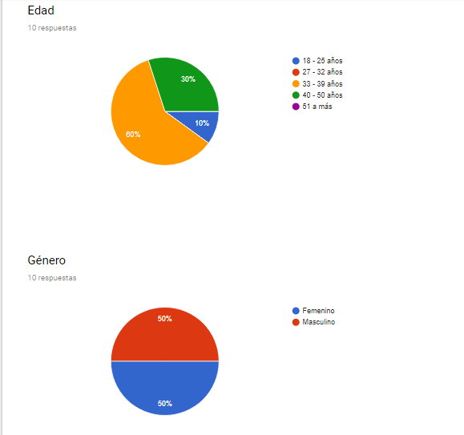
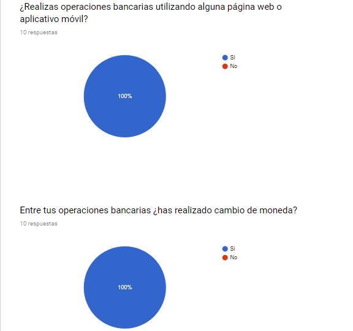
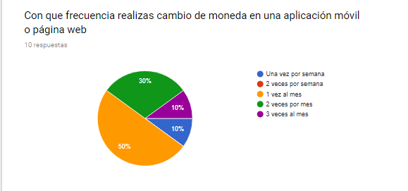
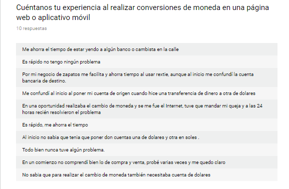
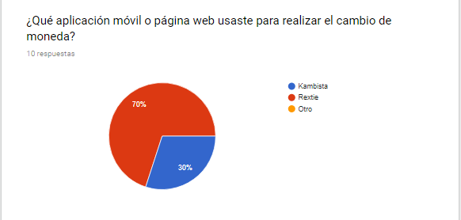
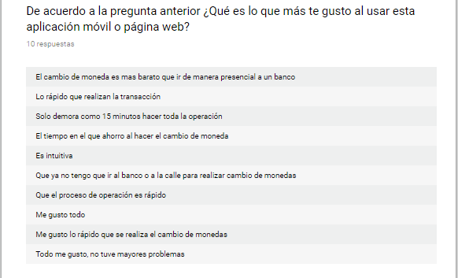

# Rextie

Rextie es un servicio de cambio de dólares por internet, registrado como casa de cambio en la SBS. Está dirigido a personas, pequeñas y medianas empresas.

# Objetivo del proyecto

Proponer un nuevo diseño de la aplicación web (zona privada) que facilite a los usuarios realizar una cotización y operación de cambio de dólares.

# Descubrimiento e investigación

## Encuesta online

Se realizó una encuesta online a 10 personas, para conocer un poco mas de sus experiencias al realizar cambios de moneda online. 

## Entrevistas personales.

Se realizó entrevistas a 3 usuarios, en la cual  se les pidió que usaran la página web de Rextie y contaran su experiencia, agregando detalles de lo que hacen al ingresar para lograr el objetivo.

* David Jaime

    *  Le costo entender el funcionamiento de la app, pues penso que era mas intuitiva.

    *  Tuvo que probar un par de veces para saber que quería decir “Quiero” y  “Tengo”.

    *  No le quedo claro  cuando era compra o venta. 

* Gabriela Urquizo

    * No se dio cuenta que al  poner una cantidad de dinero tenía que hacer clic en otro  lugar  para que la conversión se realice.

    * No comprendio en que momento era compra y venta.

    * Tardo en  entender   cómo  hacer una cambio en viceversa dólares - soles.

* Luis Merino

    * No comprendió  que si o si  necesitaba dos cuentas bancarias: una cuenta de soles y otra de dólares.

    * Tuvo que realizar el proceso de probar la cotización de moneda  varias veces para entender lo que quería decir  “Quiero” y  “Tengo”.

## Resultados de la investigación

* No comprendieron rápidamente cuando es una compra o venta.

* No se muestra con claridad la cuenta a la que se tiene que realizar la transferencia del dinero.

* El diseño debe ser más intuitivo al querer hacer la conversión dólares - soles y viceversa.

* No les queda muy claro que se necesita dos cuentas bancarias: una en soles y otra en dólares.

# Ideación

## User persona

## Prototipado

Prototipo alta fidelidad

https://marvelapp.com/153gc69g 
